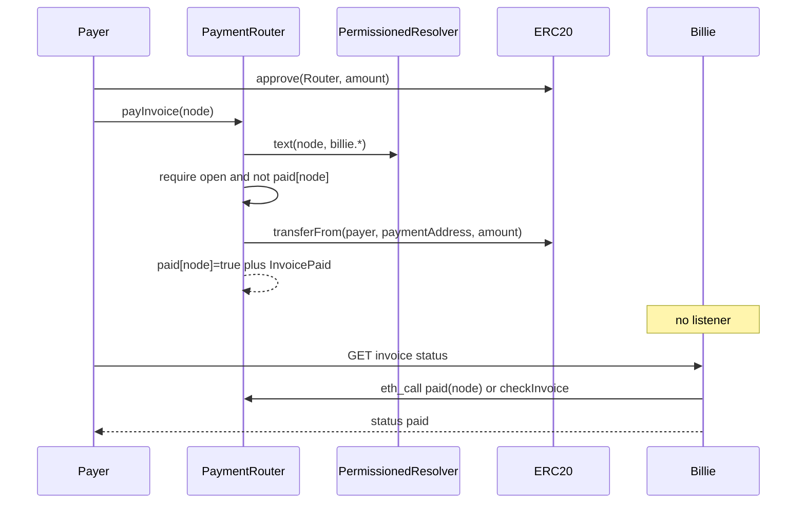

# Invoice Payment Router

## Overview

Add a small on-chain `PaymentRouter` that reads machine-readable ENS text records for an invoice and accepts payment via `approve` + `payInvoice`. Billie computes `paid` lazily on status requests (`eth_call` to `paid(node)` / `checkInvoice`) — no event listener in v1.

## Payment flow



## Status without a listener (v1)

No indexer. On `GET` status / resolve, Billie does a lazy on-chain check.

**Preferred (fast RPC):** one `eth_call` on the router:

- `paid(node)` → `bool`, or
- `checkInvoice(node)` → includes `payable_` / reason `already_paid`

A view call is typically tens to ~100ms on a normal Sepolia RPC. It does not depend on block range.

`eth_getLogs` for `InvoicePaid` is possible if `node` is indexed, but slower and subject to provider range limits. Not needed in v1: settlement truth is `paid[node]` on the router (also the anti-double-pay lock).

**ENS `billie.status`:**

- Source of truth for “paid via Billie Pay” = `router.paid(node)`.
- ENS `billie.status` stays `open` at issue time.
- API returns a **computed** status: `paid` if `router.paid(node)`, else the ENS text value (`open` / `cancelled` / …).
- Optional later: on GET, if on-chain paid and ENS still `open`, Billie lazily `setText(..., "paid")` for pure ENS readers.

## ENS text fields required for settlement

Today’s fields are not enough for on-chain pay: `billie.currency` is a ticker string, `billie.recipient` is an ENS name, `billie.amount` is freeform.

| Key | Purpose |
|-----|---------|
| `billie.token` | ERC-20 address |
| `billie.paymentAddress` | Where funds go (usually agent wallet / treasury) |
| `billie.amount` | **Atomic units** as a decimal string (e.g. `"1000000"` for 1 USDC) |
| `billie.status` | Issuer: `open` / `cancelled` / `rejected`; `paid` is computed / optional cache |
| existing | `invoiceId`, attestation, agent, humanId, currency (human ticker) |

Without `billie.token` + atomic `amount` + `paymentAddress`, the router cannot settle on-chain.

## PaymentRouter contract

Deployed by the operator via ops script (`BILLIE_PRIVATE_KEY` pays gas). Address stored as `BILLIE_PAYMENT_ROUTER`.

```solidity
function paid(bytes32 node) external view returns (bool);

function checkInvoice(bytes32 node) external view returns (
  bool payable_,
  address token,
  address paymentAddress,
  uint256 amount,
  string memory status,
  string memory reason
);

function payInvoice(bytes32 node) external;

event InvoicePaid(
  bytes32 indexed node,
  string invoiceId,
  address indexed payer,
  address token,
  address paymentAddress,
  uint256 amount
);
```

**`payInvoice` behavior:**

1. Read texts from admin-set Billie `PermissionedResolver` (all invoices share it; no ENSv2 walk).
2. Parse `token`, `paymentAddress`, `amount`; require ENS `status == "open"`.
3. Anti-double-pay: `mapping(bytes32 => bool) paid` set before external calls.
4. `IERC20.transferFrom(msg.sender, paymentAddress, amount)`.
5. Emit `InvoicePaid` (audit / future indexer; not required for v1 status).

Do **not** grant the router `ROLE_SET_TEXT`.

## UX (Billie Pay)

1. User pastes `inv-01.alice….eth`.
2. Billie: `namehash` → `checkInvoice(node)` (+ ENS texts for UI).
3. Wallet: `approve` → `payInvoice(node)`.
4. After receipt: GET status → `paid(node) === true` → UI shows Paid.

## External transfers (plain ERC-20)

Not auto-closed. A plain `transfer` to `paymentAddress` does not set `paid[node]`.

v1 policy: Paid only via the router. External / manual `markPaid` can come later.

## Implementation order

1. Extend ENS text schema (`token`, `paymentAddress`, atomic amount) on issue.
2. Operator runs payment-router deploy script → set `BILLIE_PAYMENT_ROUTER`.
3. Status/resolve API: lazy `eth_call` to `paid` / `checkInvoice`.
4. Minimal pay flow: check → approve → pay → re-check status.

## Risks

| Risk | Mitigation |
|------|------------|
| Double pay | `paid[node]` on router |
| Amount parsing in Solidity | Decimal atomic string only |
| Slow status via logs | Use `eth_call` only |
| ENS readers still see `open` | API computed status; optional lazy `setText` later |
| Native ETH | ERC-20 only in v1 |
